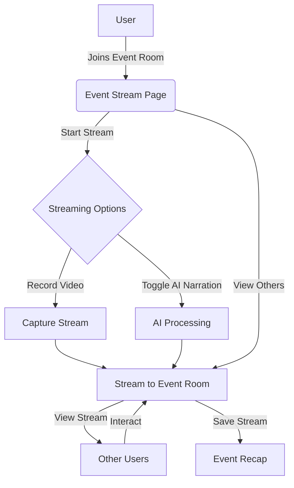

# Event Streaming App

## Simply Stream and Share

Event Streaming App is a revolutionary platform that allows users to stream and share their experiences at events in real-time. Whether you're at a concert, a conference, or a sports game, our app makes it easy to broadcast your perspective to the world.

## Introduction

In today's connected world, sharing experiences has become an integral part of how we communicate and engage with others. Event Streaming App was born from the idea that every moment at an event is unique and worth sharing. Our platform provides a seamless way for users to stream live content, while also allowing them to view streams from other attendees at the same event.

Think of it as a more focused, event-specific version of popular social media platforms. It's TikTok-esque in its simplicity and short-form content, but tailored specifically for live events.

## Functionality

Event Streaming App offers a range of features designed to enhance the event experience:

1. **Live Streaming**: Users can start a live video stream with just a tap, sharing their perspective of the event in real-time.

2. **Event-Specific Rooms**: Each event has its own digital "room" where all streams related to that event are collected and displayed.

3. **View Other Streams**: Users can watch both live and recent streams from other attendees at the same event, getting a multi-faceted view of what's happening.

4. **AI Narration**: An optional AI feature can provide real-time narration of what's happening in the stream, making content more accessible and adding an extra layer of engagement.

5. **Short-Form Content**: Streams are kept short (10-60 seconds) to maintain engagement and allow for quick, easy consumption.

6. **Social Media Integration**: Users can easily share their streams to other social media platforms directly from the app.

7. **Event Recap**: After an event ends, all streams are compiled to create a comprehensive recap of the event from multiple perspectives.

Here's a high-level overview of how the app works:



## Technology Stack

AndlerRL: @workspace make a readme explaining the workspace folder structure, how to run it locally and dependecie list (documentation links included).

Workspace: # Event Streaming App

### Workspace Folder Structure

The workspace is organized as follows:

- **.env**: Environment variables for local development.
- **.env.example**: Example environment variables file.
- **.github/**: GitHub-specific files and workflows.
  - **workflows/**: GitHub Actions workflows.
- **.next/**: Next.js build output and cache.
- **app/**: Main application code.
  - **(auth-pages)**: Authentication-related pages.
  - **auth/**: Authentication logic and components.
  - **css/**: CSS styles.
  - **event/**: Event-related components and logic.
  - **layout.tsx**: Layout component.
  - **page.tsx**: Main page component.
  - **protected/**: Protected routes and components.
- **components/**: Reusable UI components.
- **lib/**: Library and utility functions.
- **server/**: Server-side code.
- **supabase/**: Supabase configuration and related files.
- **utils/**: Utility functions and helpers.
- **bun.lockb**: Bun package manager lock file.
- **components.json**: Configuration for components.
- **LICENSE**: License file.
- **middleware.ts**: Middleware configuration.
- **next-env.d.ts**: Next.js environment types.
- **next.config.js**: Next.js configuration.
- **package.json**: Project dependencies and scripts.
- **postcss.config.js**: PostCSS configuration.
- **README.md**: Project documentation.
- **tailwind.config.ts**: Tailwind CSS configuration.
- **tsconfig.json**: TypeScript configuration.
- **tsconfig.server.json**: TypeScript configuration for the server.

### How to Run Locally

1. **Clone the repository**:

    ```sh
    git clone https://github.com/your-repo/event-streaming-app.git
    cd event-streaming-app
    ```

2. **Install dependencies**:

    ```sh
    npm install
    ```

3. **Set up environment variables**:
    - Copy [`.env.example`](/.env.example) to [`.env`](./.env) and populate it with your environment-specific values.

4. **Run the development server**:

    ```sh
    npm run dev
    ```

5. **Build the project**:

    ```sh
    npm run build
    ```

6. **Start the production server**:

    ```sh
    npm start
    ```

### Dependencies

The project uses the following dependencies:

- **tailwindcss**: [Documentation](https://tailwindcss.com/docs)
- **clsx**: [Documentation](https://github.com/lukeed/clsx)
- **cva**: [Documentation](https://cva.style/docs)
- **framer-motion**: [Documentation](https://www.framer.com/api/motion/)
- **@radix-ui/react-avatar**: [Documentation](https://www.radix-ui.com/docs/primitives/components/avatar)
- **@radix-ui/react-checkbox**: [Documentation](https://www.radix-ui.com/docs/primitives/components/checkbox)
- **@radix-ui/react-dialog**: [Documentation](https://www.radix-ui.com/docs/primitives/components/dialog)
- **@radix-ui/react-dropdown-menu**: [Documentation](https://www.radix-ui.com/docs/primitives/components/dropdown-menu)
- **@radix-ui/react-icons**: [Documentation](https://www.radix-ui.com/docs/primitives/components/icons)
- **@radix-ui/react-label**: [Documentation](https://www.radix-ui.com/docs/primitives/components/label)
- **@radix-ui/react-slot**: [Documentation](https://www.radix-ui.com/docs/primitives/components/slot)
- **@supabase/ssr**: [Documentation](https://supabase.com/docs/guides/auth/server-side/nextjs)

For a complete list of dependencies, refer to the [`package.json`](./package.json") file.

---

## License

This project is licensed under the MIT License - see the [`LICENSE`](./LICENSE") file for details.

## How to Contribute

We welcome contributions from the community! However, please note that while this project is open-source, the original codebase is owned solely by Andler Develops and affiliated organizations such as Bitcash Org. Contributors must be part of these organizations to modify the original code.

If you're not part of these organizations, you're welcome to fork the repository and make modifications to your fork. We appreciate any improvements or suggestions you might have!

### Coding Standards

To maintain code quality and consistency, please adhere to the following guidelines:

1. Follow the existing code style and structure.
2. Write clear, descriptive commit messages.
3. Document any new functions or complex logic.
4. Write unit tests for new features or bug fixes.
5. Ensure your code passes all existing tests before submitting a pull request.

[Additional coding rules to be provided by the repository owner]

## License

This project is licensed under the MIT License - see the [LICENSE](LICENSE) file for details.

---

© 2024 Andler Develops. All rights reserved.
