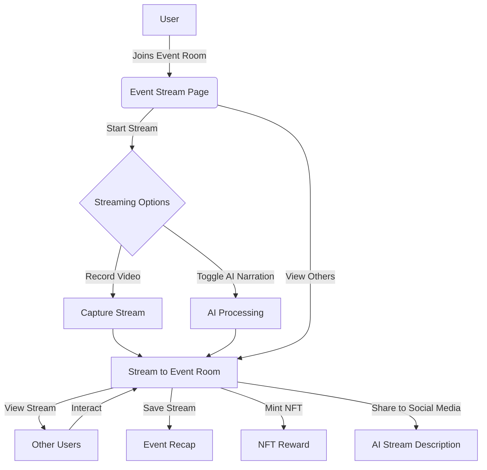

# MintMoments: MintMoments

## Mint Every Moment. Seamless Stream and Share Your Experiences

MintMoments is a revolutionary platform that allows users to stream and share their experiences at events in real-time. Whether you're at a concert, a conference, or a sports game, our app makes it easy to broadcast your perspective to the world. Connect to the web2 and web3 world by minting NFTs (or event rewards) from your event experiences.

## Introduction

In today's connected world, sharing experiences has become an integral part of how we communicate and engage with others. MintMoments was born from the idea that every moment at an event is unique and worth sharing. Our platform provides a seamless way for users to stream live content, while also allowing them to view streams from other attendees at the same event.

Think of it as a more focused, event-specific version of popular social media platforms. It's TikTok-esque in its simplicity and short-form content, but tailored specifically for live events.

## Functionality

MintMoments offers a range of features designed to enhance the event experience:

1. **Live Streaming**: Users can start a live video stream with just a tap, sharing their perspective of the event in real-time. Every end of stream will be scoring based on the number of viewers and interactions and be rewarded with NFTs.

2. **Event-Specific Rooms**: Each event has its own digital "room" event where all streams related to that event are collected and displayed. Every event has its own unique room, making it easy for users to find and share content (and authenticate, i.e. using tickets to get into an event).

3. **View Other Streams**: Users can watch both live and recent streams from other attendees at the same event, getting a multi-faceted view of what's happening. Every viewer can interact with the streamer by sending emojis and comments. The more interactions between streamers, the more the chance to be rewarded with NFTs.

4. **AI Narration**: An optional AI feature can provide real-time narration of what's happening in the stream, making content more accessible and adding an extra layer of engagement. Give your own event touch by narrating sports games, concerts, conferences or simple funny moments!

5. **Short-Form Content**: Streams are kept short (up to 60 seconds) to maintain engagement and allow for quick, easy consumption.

6. **Social Media Integration**: Users can easily share their streams to other social media platforms directly from the app. This optional feature allows users to reach a wider audience and increase engagement.

7. **Event Recap**: After an event ends, all streams are compiled to create a comprehensive recap of the event from multiple perspectives.

8. **NFT Integration**: Users can mint their event activity by streaming or interacting within the platform. A seamless way to mint NFTs from your event experiences. We gamify the event experience by rewarding users with NFTs based on their interactions and stream quality.

## Product Design Problem and Solution

### Problem

In the current digital landscape, sharing live experiences at events is often fragmented and lacks a cohesive platform. Users typically rely on general social media platforms that are not optimized for event-specific content, leading to a diluted and less engaging experience. Additionally, these platforms do not provide a unified view of an event from multiple perspectives, making it difficult for users to fully immerse themselves in the event atmosphere.

### Solution

MintMoments addresses these issues by providing a dedicated platform for live event streaming. The app's event-specific rooms collect all related streams in one place, offering users a comprehensive and immersive experience. The short-form content format ensures high engagement, while features like AI narration and social media integration enhance accessibility and sharing capabilities. By focusing on live events, the app creates a unique and engaging way for users to share and experience events in real-time.

## High-level App Overview

---

## Roadmap

### Phase 0: App Concepts [Completed]

- [x] **Event Room Creation:** Users can join to already existent event-specific rooms to share live streams.
- [x] **Live Streaming:** Users can start live video streams within an event room. Viewers can watch the streams in real-time.
- [x] **User Authentication:** Any can join and access with One-Time-Passwords (OTP) send to emails.
- [x] **Mobile First:** The app is optimized for mobile devices.
- [x] **AI Description:** Optional AI feature provides real-time description of live streams.
- [x] **Loves and shares of the event:** Users can love and share the event to other social media platforms.
- [x] **Testing concept on an event:** Test the app on a real event to gather feedback and improve the user experience.

### Phase 1: Core Features [In Progress]

- [ ] **Social Media Integration:** Users can share streams to other social media platforms.
- [ ] **Improve Video Recording UI:** Enhance the video recording UI to make it more user-friendly.
- [ ] **Web3 Wallet Connect:** Enable user capabilities to connect a wallet to their accounts.
- [ ] **Designing The Ticket Concept:** Design the ticket concept to authenticate users at events.
- [ ] **Event Authentication:** Users can authenticate their attendance at an event to access event rooms.
- [ ] **Designing The Game Concept:** Design the game concept to reward users with NFTs or unique event rewards (for web2 events) based on their interactions and stream quality.
- [ ] **Adding Comments Section:** Web3 chat integration to allow users to securely interact with each other when the event is happening.
- [ ] **Create Smart Contract:** Create a smart contract to mint NFTs based on event interactions and stream quality. Escrow the NFTs until the event ends.

### Phase 2: Advanced Features [Pending]

- [ ] **NFT Integration:** Users can mint NFTs based on their event interactions and stream quality.
- [ ] **Event Recap:** All streams are compiled into a recap after the event ends.
- [ ] **Gamification Integration:** Users are rewarded with unique event rewards based on their interactions and stream quality.
- [ ] **AI Narration:** Optional AI feature provides real-time narration of live streams. Narrator would have personality per event.
- [ ] **Stream Interaction:** Users can interact with live streams by sending emojis and comments.
- [ ] **Responsive Design:** The app is optimized for mobile and desktop devices.

### Phase 3: Scaling and Optimization [Future]

- [ ] **Scaling Infrastructure:** Optimize the app's infrastructure to handle a large number of concurrent streams and users.
- [ ] **Performance Optimization:** Improve app performance to reduce latency and increase responsiveness.
- [ ] **Security Enhancements:** Implement additional security measures to protect user data and prevent unauthorized access.
- [ ] **User Feedback:** Gather feedback from users to identify areas for improvement and new feature ideas.
- [ ] **Bug Fixes:** Address any bugs or issues reported by users to ensure a smooth user experience.
- [ ] **Documentation:** Create comprehensive documentation for the app to help new users and developers understand its features and functionality.

## Technology Stack

To know more about the technology stack, please refer to the [`./apps/web/README.md`](./apps/web/README.md) file.

---

## License

This project is licensed under the MIT License - see the [`LICENSE`](./LICENSE") file for details.

## How to Contribute

Please note that while this project is open-source, the original codebase is owned solely by Andler Develops and affiliated organizations such as Bitcash Org. Contributors must be part of these organizations to modify the original code.

If you're not part of these organizations, you're welcome to fork the repository and make modifications to your fork. We appreciate any improvements or suggestions you might have!

### Coding Standards

To maintain code quality and consistency, please adhere to the following guidelines:

1. Follow the existing code style and structure.
2. Write clear, descriptive commit messages.
3. Document any new functions or complex logic.
4. Write unit tests for new features or bug fixes.
5. Ensure your code passes all existing tests before submitting a pull request.

[Additional coding rules to be provided by the repository owner]

## License

This project is licensed under the MIT License - see the [LICENSE](LICENSE) file for details.

---

© 2024 Andler Develops. All rights reserved.
